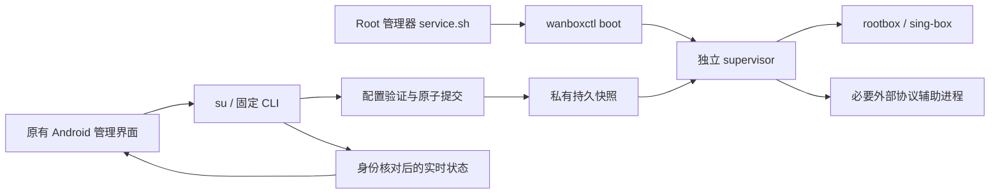

# 纯 Root 模块化实施记录

作者：雾晚。此分支先在本地实施与验证；用户随后授权发布实验预览版。实际发布状态以 Actions 与 Release 为准。

## 基线与原因

- wanBox 基线：`1ea09c6aef379cecac09c7237cc088e9bffa44bb`，本地分支 `feat/root-module-runtime`。
- 官方核心 pin：`v1.15.0-alpha.10`，官方源码 `c992297988288565a24a6d36e2cf4d77cb835fcd`，未改 pin 或官方源代码。
- 旧 RootTunService 持有 su 子进程、App 私有配置以及 App PID；独立执行文件仍依赖 App 生命周期。旧代码还保留 VPN 授权与失败回退。
- 参考 [NetProxy lifecycle](https://github.com/Fanju6/NetProxy-Magisk/blob/27c909d9f0982355b7f3a6c767ecccfc9e56770a/src/native/netproxy/internal/module/lifecycle.go)、[配置事务](https://github.com/Fanju6/NetProxy-Magisk/blob/27c909d9f0982355b7f3a6c767ecccfc9e56770a/src/native/netproxy/internal/module/config_transaction.go)、[启动脚本](https://github.com/Fanju6/NetProxy-Magisk/blob/27c909d9f0982355b7f3a6c767ecccfc9e56770a/src/module/service.sh)。仅借鉴模块启动、监督器、事务模式，未复制实现。
- 安装约定依据 [Magisk 模块指南](https://topjohnwu.github.io/Magisk/guides.html)、[KernelSU 模块指南](https://kernelsu.org/guide/module.html)。实际管理器安装兼容仍待设备验证。

## 进程与数据流



模块代码在 `/data/adb/modules/wanbox`；持久数据在 `/data/adb/wanbox`。监督器不是 App 子服务；在 Android 上通过现有 cgroup mount 信息把自身迁到 init 的 cgroup，失败即拒绝运行。此机制是否避开各管理器/厂商的 force-stop/freezer 必须实测，不保证所有设备兼容。

App 的 RootTunService 仅在绑定时观察模块。页面隐藏后解绑并停止观察，不停止核心。模块拥有 TUN、原生网络监听、有限重启和资源释放。App 的订阅更新、节点编辑及单独节点测速仍属于管理任务；它们按需持有物理网络监听，不充当后台 watchdog。

## 配置契约与回滚

`schemaVersion=1`，配置对象、Base64 资源、固定辅助协议清单、用户自启/性能偏好、节点显示信息及 `expectedRevision` 构成快照。现有 Room、备份格式、订阅、路由顺序不改；从现有数据库生成快照而非搬迁/清空数据库。历史 VPN/proxy 模式值按产品要求归一化为 Root，不保留 VPN 后备能力。

1. 解析和大小/路径校验：编码最多 192 MiB、配置 8 MiB、资源总量 128 MiB、单文件 64 MiB、512 文件、32 辅助进程；禁绝 App 绝对路径/路径穿越。
2. 私有 staging 完整写入配置、Geo/SRS/CA、YACD 和所需插件资源，真正调用固定核心 `--check`（30 秒上限）。Geo 别名兼容旧规则；缺失/损坏资源不得静默成为空规则。
3. revision 冲突先拒绝；当前核心保持运行直到校验成功。保存 previous，再停止、原子提交 current、启动新核心。启动失败完整停止新核心后恢复上一版；清理失败不再启动。
4. 手工 `config rollback` 可恢复 previous；`config validate` 不接管流量。首次没有有效快照时 boot 不启动。

验证配置不等于节点可连。远程规则集仍沿用现有下载/初始处理能力，不把离线 schema 校验说成完整网络验证。自定义配置若依赖无法快照化的外部文件将明确拒绝，不能继续依赖 App 存储。

每次核心生命周期最多 4 次启动，退避 1/2/4 秒；预算耗尽需手动重试。身份使用 PID、启动时间、可执行路径；旧 PID 不作当前成功。辅助进程可在身份验证后有限升级 SIGKILL；核心保留 SIGTERM 清理路径，清理超时拒绝重启。状态没有 ready/有效进程时不展示旧统计。

## UI 与产品边界

保留主题、布局、导航、桌面图标、节点/规则卡片、磁贴、快捷方式。原连接按钮改为提交配置/启动模块，停止只控制模块；App 打开从 CLI 查询实际状态。VPN Service/授权 Activity/回退及可用模式选项已移除，共享 Root TUN 地址、路由、DNS 配置仍保留。

原“自动连接”值不擅自改变：App 成功控制模块后同步自启开关，模块 boot 尊重持久 opt-out。App-only WakeLock/唤醒后重置选项保留旧键值但禁用并说明模块管理；不虚构 native WakeLock。App 不再拥有代理前台通知；模块状态由原管理界面显示。Widget 在 App 绑定或显式动作后更新，关闭 App 时不会增加常驻轮询，其显示可能滞后，点击动作仍查询真实模块状态。

## 清理与设备验收门槛

启动/停止、禁用（监督器最多 10 秒发现）、升级及卸载只清理本模块识别的进程，通过 sing-tun Close 释放路由；不全局 flush 防火墙。卸载模块/App 均保留私有恢复快照；其中包含凭据，不能上传。升级先停止旧核心，清理失败即拒绝升级。

**不能据此宣称 SIGKILL/内核崩溃后的网络恢复已完成。** 现有 TUN 名称及核心 auto-redirect 规则命名仍须与其他 Root 模块做冲突验证；安装前停用其他接管 TUN 的模块，不自动清理他人的路由。模块管理器强制卸载/内核断电也可能跳过优雅清理。

| 验收环境/操作 | 当前状态 |
|---|---|
| Magisk 安装、启用、升级/卸载与重启自启 | 无在线 Root 设备，未执行 |
| KernelSU 相同流程、SELinux 与 cgroup 脱离 | 未执行 |
| 关闭/强停/卸载 App 后真实代理继续、重开状态一致 | 未执行 |
| Wi-Fi/蜂窝、断网恢复、IPv4/IPv6/DNS/UDP、Doze | 未执行 |
| Linux 真实子进程/取消/回滚 fixture 与 race | 首次 Actions Native Build 已通过；后续热更新版本以本次 Actions 结果为准 |
| Android 仪器测试与 UI 前后截图 | 仅编译，未执行 |

设备验收：先备份并连接同一虚构/测试节点，记录 `status` 的 supervisor/core PID 与 revision；依次关闭页面、force-stop 管理 App、重开、更新配置、提交损坏配置、重启、自启关闭、禁用/启用、升级、卸载。每步验证代理实际通路、私有数据保留、进程数、`ip rule`/路由/防火墙前后差异。执行两种管理器并覆盖上述网络矩阵后才可发布支持结论。

## 本地验证命令

```text
go -C rootmodule test -count=1 -v ./...
go -C rootmodule vet ./...
python -m unittest discover -s rootmodule -p test_pack.py
(cd libcore && go test ./internal/...)
go -C ../sing-box run ./cmd/sing-box check -c docs/config/local-proxy.json
go -C ../sing-box run ./cmd/sing-box check -c docs/config/tun-fakeip.json
gradlew.bat --offline --no-daemon :app:testPreviewDebugUnitTest :app:assemblePreviewDebug :app:compilePreviewDebugAndroidTestKotlin
gradlew.bat --offline --no-daemon :app:lintPreviewDebug
git diff --check
```

配置校验实际应传绝对配置文件路径。Android Go CLI/rootbox 使用 NDK Android31 ARM64 编译为 PIE，fresh core 含 `rootmodule` build tag；主线四 ABI 构建能力保留。构建 Android 管理 APK 的既有 AAR 不是手工修改对象，新的独立核心由源码编译并放在 ZIP。

本地 Debug APK 不使用正式版发布签名，不能声称可覆盖已安装正式版；需使用原发布流程与原签名验证升级，不能让用户卸载丢数据。版本号/包名/签名策略均未改。产物清单、校验和和实际结果记录在交付目录，生成文件不提交。

## 免手机重启更新与三种数据方式

`install.go` 校验固定文件白名单、SHA256/大小、ARM64 PIE、模块 ID，并用新核心重新校验当前快照。待旧进程清理后，在模块目录同一文件系统 rename 切换代码；若正在连接则重启核心，失败尝试回滚。管理器 staging 必须与活动目录不同；SELinux、管理器挂载及断电原子性仍是设备验收项。手机无需重启不等于连接无中断。

`pack.py` 生成不带 APK包及 manifest；`bundle_manager.py` 在 CI 已验证原签名/包名/版本/ABI 后加入同一公开 APK，生成带管理 APK包。仅后者执行 Android package shell 安装，失败不回滚模块，也不删除旧 App 数据。

管理 App 的「模块更新数据」提供默认保留全部、全新安装、仅保留节点/订阅。后两项是用户确认的更新前准备：先用真实 PortableBackup 导出全部数据到私有持久文件，再通过 root CLI `data prepare` 停止并归档模块配置。Room 的现有跨数据库事务写入完整空计划或保留节点/分组计划，最后 `data finish`。路由/其他偏好不保留；不改 Room schema，不 root 操作 App SQLite，不执行 pm clear、不删除内置资源和备份。

App AtomicFile 日志和模块固定路径日志持久化步骤。中断时 App 从备份重复同一计划，模块完成剩余 rename；未完成时 CLI 的连接、配置提交、升级受阻。两个存储域不伪称同一 SQLite 原子事务；恢复机制提供可重入完成及完整备份。模块 `data rollback` 只用于未完成事务的管理员恢复，使用前应先恢复对应 App 完整备份。归档保留敏感凭据且不自动删除，用户可从 App 页面分享完整备份再用已有导入入口恢复。

新增测试覆盖代码切换/损坏拒绝/新核心不兼容/启动失败回滚、禁用和卸载标志、数据准备重入/连接阻断/归档恢复。启动失败测试用注入的生命周期故障，不能替代 Android Root 真机。Android 节点保留与清空使用真实序列化/Room 的仪器测试另行编译，执行结果以设备/CI 记录为准。
